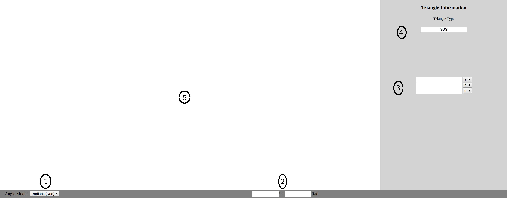

# **[Triangle Solver](https://saurabhtotey.github.io/Triangle-Solver/)**
Made by Saurabh Totey\

1. **Angle-Mode Selection**
2. **Angle-Conversion Boxes**
3. **Triangle Information Input Boxes**
4. **Triangle Type Box**
5. **Triangle Drawing Area**

### Angle-Mode Selection
In this box, you can select what type of angles to use (either Radians or Degrees). This will affect how the angles will be displayed and inputted.

### Angle-Conversion Boxes
In this section, you can input an angle of either radians or degrees in the corresponding box, and the other box will update with the equivalent angle in the other form. For example, you can put 2*pi under the radians box, and then the degrees box will update with 360 degrees.

### Triangle Information Input Boxes
Here, you input your triangle information. 'a', 'b', and 'c' are triangle sides. 'A', 'B', and 'C' are angles opposite the sides of the same letter. Upon completion of all information, the triangle will be drawn if valid.

### Triangle Type Box
This box describes what type of triangle is going to be drawn. 'A' corresponds to angle, and 'S' corresponds to side. For example, 'SSS' means 3 sides were provided, whereas 'ASA' means the triangle has an angle adjacent to a side adjacent to another angle. Due to the nature of triangles, type palindromes have the same meaning (eg. 'AAS' == 'SAA'). Keep note that 'AAA', 'SSA', and 'ASS' triangles don't supply information for a unique triangle. For 'AAA' triangles, it will be assumed that the smallest side has length 1, and then the rest of the triangle will be solved accordingly. For 'SSA' and 'ASS' triangles, if there exists 2 solutions from the supplied information, both will be given.

### Triangle Drawing Area
This is where triangles are drawn and the solution information is given. This draws the solution to scale gives the solution information in the top left corner. Be aware that this information won't be exact due to small rounding errors and propagation of small rounding errors through calculations. In the event of an 'SSA' or an 'ASS' triangle with two solutions, both triangles will be drawn and both triangle's information will be supplied.